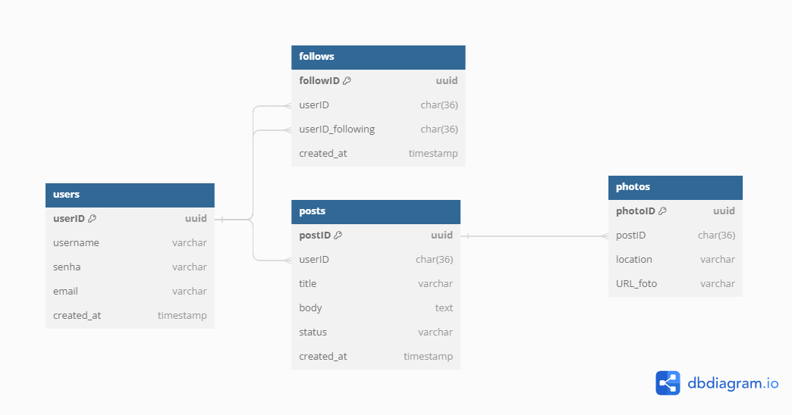

# Vacation Backend Application

Welcome to the Vacation Backend Application! This application allows users to share photos of their vacation experiences, showcasing beautiful and travel-friendly places around the world.

## Features

- **Photo Sharing**: Users can upload and share photos of their vacation experiences.
- **Discover**: Users can explore the most beautiful and travel-friendly places shared by other users.

## Database scheema

## TODO

### DB

- [x] Create Docker DB
- [x] Implement Database Migrations
- [x] Create Schema

### Devops

- [ ] CI/CD
  - [x] Tests for pull request
  - [ ] Continuous Integration setup
  - [ ] Continuous Deployment setup
- [ ] Monitoring setup
- [x] Logging setup

## API

- [ ] Implement user routers.
  - [x] Create User
  - [x] Update User
  - [x] Delete User
- [ ] Implement authentication
  - [x] User login
  - [x] User registration
  - [ ] JWT token generation and validation
- [x] Implement post routers
  - [x] Create Post
  - [x] Update Post
  - [x] Delete Post
- [x] Implement photo uploading
- [x] Implement photo retrieval
